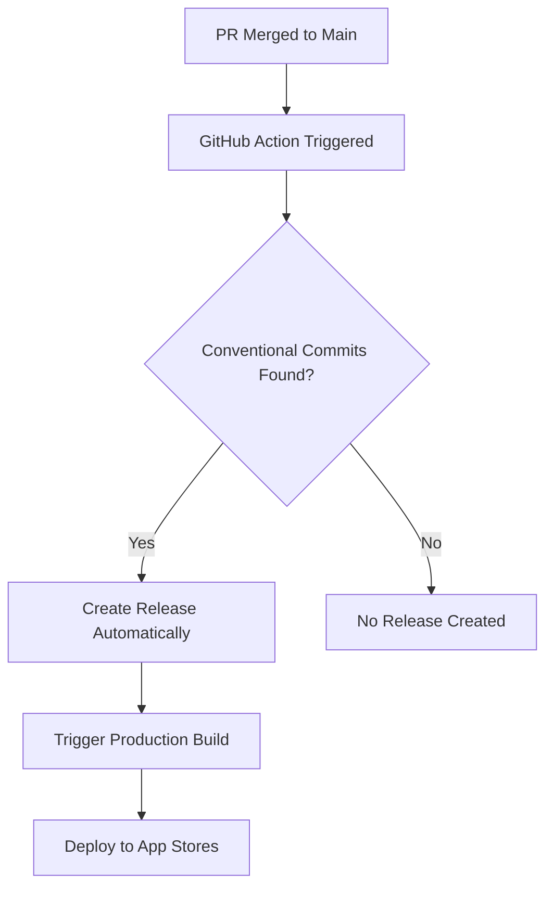

# 🤖 Automated Release Strategies

This document outlines common industry approaches to automated releases and why manual releases are problematic.

## ❌ Why Manual Releases Are Problematic

### Issues with `bun run release` by developers:

1. **Human Error** - Developers forget to run releases or make mistakes
2. **Inconsistency** - Different developers may release at different times
3. **Bottlenecks** - Only certain people can create releases
4. **No Audit Trail** - Hard to track who released what and when
5. **Coordination Issues** - Multiple developers might try to release simultaneously
6. **Forgotten Releases** - Features sit unreleased for weeks
7. **Emergency Delays** - Manual process slows down hotfixes

## 🏭 Industry Standard Approaches

### 1. **Automated Release on Main Branch** (Recommended)

**How it works:**
- Every merge to `main` automatically triggers release evaluation
- If conventional commits are found, a release is created automatically
- Production deployment happens immediately after release

**Pros:**
- ✅ Zero human intervention needed
- ✅ Consistent release timing
- ✅ Fast hotfix deployment
- ✅ No forgotten releases
- ✅ Clear audit trail

**Cons:**
- ⚠️ Requires disciplined conventional commits
- ⚠️ Less control over release timing



### 2. **Release Please Workflow** (Google's Approach)

**How it works:**
- Creates release PRs automatically based on commits
- Team reviews and merges release PRs
- Merging release PR creates the actual release

**Pros:**
- ✅ Automated changelog generation
- ✅ Team review of releases
- ✅ Clear release planning
- ✅ Professional workflow

**Cons:**
- ⚠️ More complex setup
- ⚠️ Requires PR review process

### 3. **Scheduled Releases** (Enterprise Approach)

**How it works:**
- Releases happen on a fixed schedule (weekly, bi-weekly)
- Automated system creates releases at scheduled times
- Only includes changes that are ready

**Pros:**
- ✅ Predictable release schedule
- ✅ Good for coordinating with business
- ✅ Allows for proper testing cycles

**Cons:**
- ⚠️ Slower hotfix deployment
- ⚠️ Features may wait for next cycle

### 4. **Tag-Based Releases** (Simple Approach)

**How it works:**
- Developers create git tags when ready to release
- CI/CD system detects new tags and creates releases
- Provides some manual control with automation

**Pros:**
- ✅ Simple to understand
- ✅ Developer control over timing
- ✅ Automated deployment

**Cons:**
- ⚠️ Still requires manual action
- ⚠️ Can be forgotten

## 🎯 **Our Recommended Setup: Automated on Main**

I've implemented **Automated Release on Main Branch** for your project because:

### ✅ **Perfect for Mobile Apps:**
- **Fast hotfixes** - Critical bugs get fixed and deployed immediately
- **No release bottlenecks** - Any team member can merge and trigger release
- **Consistent quality** - Every release goes through the same automated process
- **Clear history** - GitHub shows exactly what triggered each release

### 🔄 **Your New Workflow:**

```bash
# 1. Developer creates feature branch
git checkout -b feat/new-feature

# 2. Makes changes with conventional commits
git commit -m "feat: add user profile customization"

# 3. Creates PR to main
gh pr create --title "feat: add user profile customization"

# 4. After PR review and merge to main:
#    → GitHub Action automatically detects conventional commits
#    → Creates release with proper version bump
#    → Generates changelog
#    → Triggers production build
#    → Deploys to TestFlight and Google Play
```

### 📊 **What Happens Automatically:**

1. **Commit Analysis** - Scans commits since last release
2. **Version Calculation** - Determines appropriate version bump
3. **Changelog Generation** - Creates release notes from commits
4. **Release Creation** - Tags and creates GitHub release
5. **Production Build** - Triggers EAS build automatically
6. **Store Deployment** - Submits to TestFlight and Google Play

## 🛠 **Available Commands for Developers**

```bash
# Check what would be released
bun run release:check

# Preview next release (without creating it)
bun run release:dry

# Get info about automated releases
bun run release:preview

# Emergency manual release (only for critical situations)
bun run release:manual
```

## 🚨 **Emergency Manual Releases**

For critical hotfixes that can't wait for the normal process:

```bash
# 1. Create hotfix branch
git checkout -b hotfix/critical-security-fix

# 2. Make fix with proper commit message
git commit -m "fix: resolve critical security vulnerability

This fixes CVE-2024-XXXX that could allow unauthorized access.

Fixes #123"

# 3. Push and create emergency PR
git push origin hotfix/critical-security-fix
gh pr create --title "HOTFIX: Critical Security Fix" --body "Emergency fix for production issue"

# 4. After merge, release happens automatically
# OR for immediate release:
standard-version && git push --follow-tags origin main
```

## 📈 **Benefits You'll See**

### **For Developers:**
- 🎯 **Focus on code** - No need to remember release commands
- 🚀 **Faster feedback** - Features reach users immediately after merge
- 🔄 **Consistent process** - Same workflow for everyone
- 📝 **Better commit messages** - Conventional commits improve code history

### **For Team:**
- 📊 **Clear release history** - Every release is documented
- 🔍 **Easy debugging** - Know exactly what changed in each version
- ⚡ **Faster hotfixes** - Critical fixes deploy in minutes, not hours
- 🎯 **No bottlenecks** - Anyone can contribute to releases

### **For Users:**
- 🚀 **Faster features** - New functionality reaches them sooner
- 🐛 **Quicker bug fixes** - Issues get resolved faster
- 📱 **More stable releases** - Consistent automated testing

## 🔧 **Configuration Details**

### **Automated Release Triggers:**
- ✅ `feat:` commits → Minor version bump
- ✅ `fix:` commits → Patch version bump  
- ✅ `perf:` commits → Patch version bump
- ✅ `BREAKING CHANGE:` → Major version bump
- ❌ `docs:`, `test:`, `chore:` → No release

### **Quality Gates:**
- All tests must pass
- Linting must pass
- Type checking must pass
- EAS build must succeed

### **Deployment Flow:**
1. Release created → Production EAS build triggered
2. iOS build → Automatic TestFlight submission
3. Android build → Automatic Google Play submission
4. Team notification (optional)

## 📚 **Best Practices**

### **Commit Messages:**
```bash
# Good - triggers minor release
feat: add dark mode support

# Good - triggers patch release  
fix: resolve crash on startup

# Good - triggers major release
feat!: redesign authentication system

# Bad - no release triggered
update code
fix stuff
wip
```

### **Branch Strategy:**
- `main` - Production releases (automated)
- `develop` - Integration testing (manual builds)
- `feature/*` - Feature development (preview builds)
- `hotfix/*` - Emergency fixes (automated after merge)

## 🔗 **Related Documentation**

- [Release Workflow Guide](./RELEASE-WORKFLOW.md) - Detailed workflow documentation
- [Git Workflow Guide](./GIT-WORKFLOW.md) - Branching and commit strategies
- [CI/CD Setup](./CI-CD-SETUP.md) - Technical implementation details
