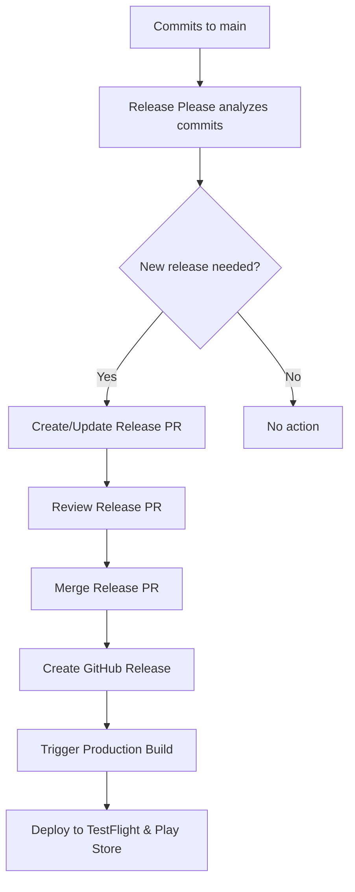

# 🏷️ Release Management Guide

This guide covers the automated release management system using release-please for the Discover Sports HK app.

## 📋 Overview

Our release management system uses [release-please](https://github.com/googleapis/release-please) to:
- Automatically generate changelogs based on conventional commits
- Create release pull requests with version bumps
- Generate GitHub releases when release PRs are merged
- Trigger production builds and app store deployments

## 🔄 Release Process Flow



## 📝 Conventional Commits

Our release system relies on [Conventional Commits](https://www.conventionalcommits.org/) to determine version bumps and generate changelogs.

### Commit Message Format

```
<type>[optional scope]: <description>

[optional body]

[optional footer(s)]
```

### Commit Types and Version Impact

| Type | Version Bump | Changelog Section | Example |
|------|--------------|-------------------|---------|
| `feat` | Minor | Features | `feat: add dark mode support` |
| `fix` | Patch | Bug Fixes | `fix: resolve crash on startup` |
| `perf` | Patch | Performance Improvements | `perf: optimize image loading` |
| `BREAKING CHANGE` | Major | Breaking Changes | `feat!: redesign navigation API` |
| `docs` | None | Documentation | `docs: update API documentation` |
| `refactor` | Patch | Code Refactoring | `refactor: simplify auth logic` |
| `test` | None | Tests (hidden) | `test: add unit tests for auth` |
| `chore` | None | Chores (hidden) | `chore: update dependencies` |
| `ci` | None | CI (hidden) | `ci: update build workflow` |
| `build` | None | Build (hidden) | `build: update webpack config` |

### Examples

#### Feature Addition (Minor Version Bump)
```bash
git commit -m "feat: add user profile customization

- Users can now customize their profile picture
- Added bio and social media links
- Improved profile editing UX"
```

#### Bug Fix (Patch Version Bump)
```bash
git commit -m "fix: resolve memory leak in image cache

The image cache was not properly releasing memory when images
were no longer needed, causing performance issues on older devices.

Fixes #123"
```

#### Breaking Change (Major Version Bump)
```bash
git commit -m "feat!: redesign authentication system

BREAKING CHANGE: The authentication API has been completely
redesigned. Users will need to re-authenticate after this update.

- New OAuth2 implementation
- Improved security with JWT tokens
- Better error handling"
```

## 🚀 Release Workflow

### 1. Automatic Release PR Creation

When commits are pushed to `main`, release-please:
1. Analyzes commit messages since the last release
2. Determines the appropriate version bump
3. Creates or updates a release PR with:
   - Updated version in `package.json`
   - Generated changelog
   - Updated version in app configuration

### 2. Release PR Review Process

**Before merging a release PR:**

- [ ] **Review changelog entries** - Ensure all changes are accurately described
- [ ] **Verify version bump** - Confirm the version increment is appropriate
- [ ] **Check breaking changes** - Ensure breaking changes are properly documented
- [ ] **Validate app metadata** - Confirm version updates in app config
- [ ] **Test staging builds** - Ensure the latest develop builds are working
- [ ] **Review app store readiness** - Check if any store metadata needs updating

### 3. Release Creation and Deployment

When a release PR is merged:
1. **GitHub Release** is created automatically
2. **Production build** is triggered automatically
3. **TestFlight submission** happens automatically
4. **Google Play submission** happens automatically

## 📱 Version Management

### Semantic Versioning Strategy

We follow [Semantic Versioning](https://semver.org/) (SemVer):

- **MAJOR** (1.0.0 → 2.0.0): Breaking changes, major redesigns
- **MINOR** (1.0.0 → 1.1.0): New features, backwards compatible
- **PATCH** (1.0.0 → 1.0.1): Bug fixes, backwards compatible

### App Store Version Mapping

| Platform | Version Source | Build Number Source |
|----------|----------------|-------------------|
| iOS | `package.json` version | EAS build number |
| Android | `package.json` version | EAS build number |
| Expo | `package.json` version | EAS build number |

### Pre-release Versions

For pre-release versions (alpha, beta, rc):
- Use conventional commits with appropriate scopes
- Pre-release versions: `1.0.0-alpha.1`, `1.0.0-beta.1`, `1.0.0-rc.1`
- Configure in `.release-please-config.json` if needed

## 🛠 Manual Release Operations

### Creating a Manual Release

```bash
# 1. Ensure you're on main branch
git checkout main
git pull origin main

# 2. Check what changes would be included
bun run release:check

# 3. Create a manual release PR (if needed)
gh pr create --title "chore: release v1.2.3" --body "Manual release for urgent fixes"
```

### Emergency Hotfix Release

For critical production issues:

1. **Create hotfix branch from main**:
   ```bash
   git checkout main
   git pull origin main
   git checkout -b hotfix/critical-fix
   ```

2. **Make the fix with proper commit message**:
   ```bash
   git commit -m "fix: resolve critical security vulnerability

   This fixes a critical security issue that could allow
   unauthorized access to user data.

   Fixes #456"
   ```

3. **Push and create PR to main**:
   ```bash
   git push origin hotfix/critical-fix
   gh pr create --title "hotfix: critical security fix" --base main
   ```

4. **After merge, release-please will create a patch release**

### Skipping Releases

To skip release creation for certain commits:
```bash
git commit -m "chore: update documentation

This change doesn't require a new release.

Release-As: skip"
```

## 📊 Monitoring Releases

### GitHub Actions

Monitor release workflows in the Actions tab:
- **Release Please**: Creates release PRs and releases
- **Production Build**: Builds and deploys to app stores

### EAS Dashboard

Track builds at: https://expo.dev/accounts/sinhong2011/projects/discover-sports-hk/builds

### App Store Status

- **TestFlight**: Check App Store Connect for beta availability
- **Google Play**: Check Play Console for internal testing status

## 🔧 Configuration

### Release Please Configuration

Key configuration files:
- `.release-please-config.json`: Main configuration
- `.release-please-manifest.json`: Version tracking

### Customizing Changelog Sections

Edit `.release-please-config.json` to modify changelog sections:

```json
{
  "changelog-sections": [
    {"type": "feat", "section": "🚀 Features", "hidden": false},
    {"type": "fix", "section": "🐛 Bug Fixes", "hidden": false},
    {"type": "perf", "section": "⚡ Performance", "hidden": false}
  ]
}
```

## 🚨 Troubleshooting

### Release PR Not Created

**Possible causes:**
- No conventional commits since last release
- All commits are of types that don't trigger releases (docs, test, chore)
- Release-please configuration issues

**Solutions:**
- Check commit messages follow conventional format
- Verify `.release-please-config.json` is valid
- Check GitHub Actions logs for errors

### Version Not Updated Correctly

**Possible causes:**
- Incorrect commit message format
- Missing breaking change indicators
- Configuration issues

**Solutions:**
- Review commit message conventions
- Use `feat!:` or `BREAKING CHANGE:` for major bumps
- Manually edit release PR if needed

### Production Build Not Triggered

**Possible causes:**
- Workflow permissions issues
- Missing secrets
- EAS configuration problems

**Solutions:**
- Check GitHub Actions permissions
- Verify all required secrets are set
- Review EAS build logs

## 📚 Best Practices

1. **Write clear commit messages** that explain the "why" not just the "what"
2. **Use conventional commit format** consistently
3. **Review release PRs carefully** before merging
4. **Test staging builds** before releasing
5. **Coordinate releases** with the team
6. **Monitor deployments** after releases
7. **Keep changelogs user-focused** - write for end users, not developers

## 🔗 Related Documentation

- [Git Workflow Guide](./GIT-WORKFLOW.md)
- [Deployment Pipeline](./DEPLOYMENT-PIPELINE.md)
- [App Publishing Guide](./APP-PUBLISHING.md)
- [CI/CD Setup](./CI-CD-SETUP.md)
