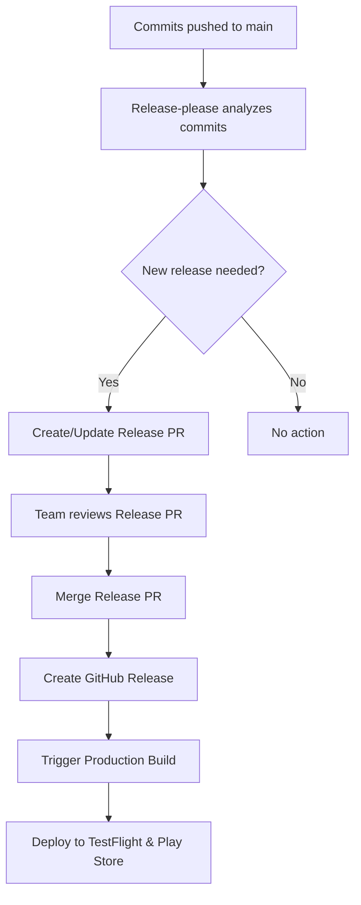

# 🚀 Release-Please Guide for Expo Apps

This guide covers our automated release management system using Google's release-please for the Discover Sports HK app.

## 📋 Overview

Release-please is Google's solution for automating releases. It's perfect for Expo React Native apps because it:
- **Creates release PRs automatically** based on conventional commits
- **Generates professional changelogs** with proper categorization
- **Handles version bumping** for both package.json and app configuration
- **Integrates seamlessly** with GitHub and EAS builds
- **Provides team review process** before releases go live

## 🔄 Release Process Flow



## 📝 Conventional Commits

Release-please uses [Conventional Commits](https://www.conventionalcommits.org/) to determine version bumps and generate changelogs.

### Commit Types and Impact

| Type | Version Bump | Changelog Section | Example |
|------|--------------|-------------------|---------|
| `feat` | Minor | 🚀 Features | `feat: add dark mode support` |
| `fix` | Patch | 🐛 Bug Fixes | `fix: resolve crash on startup` |
| `perf` | Patch | ⚡ Performance Improvements | `perf: optimize image loading` |
| `BREAKING CHANGE` | Major | Breaking Changes | `feat!: redesign navigation API` |
| `docs` | None | 📚 Documentation | `docs: update API documentation` |
| `refactor` | Patch | ♻️ Code Refactoring | `refactor: simplify auth logic` |
| `test` | None | Hidden | `test: add unit tests for auth` |
| `chore` | None | Hidden | `chore: update dependencies` |
| `ci` | None | Hidden | `ci: update build workflow` |
| `build` | None | Hidden | `build: update webpack config` |

### Perfect Commit Examples

#### Feature Addition (Minor Version Bump)
```bash
git commit -m "feat: add user profile customization

Users can now customize their profile picture, bio, and social media links.
This includes a new profile editing screen with image picker integration.

- Add profile picture upload functionality
- Implement bio text editing with character limit
- Add social media links section
- Include profile preview component

Closes #123"
```

#### Bug Fix (Patch Version Bump)
```bash
git commit -m "fix: resolve memory leak in image cache

The image cache was not properly releasing memory when images were no longer
needed, causing performance issues on older devices with limited RAM.

- Implement proper cache cleanup on memory warnings
- Add automatic cache size management
- Fix retain cycles in image loading components

Fixes #456"
```

#### Breaking Change (Major Version Bump)
```bash
git commit -m "feat!: redesign authentication system

BREAKING CHANGE: The authentication API has been completely redesigned.
Users will need to re-authenticate after this update.

- Implement OAuth2 with PKCE for better security
- Replace custom tokens with industry-standard JWT
- Add biometric authentication support
- Improve error handling and user feedback

Migration guide: See docs/AUTH_MIGRATION.md

Closes #789"
```

## 🚀 How Release-Please Works

### 1. Automatic Release PR Creation

When you push commits to `main`, release-please:
1. **Analyzes all commits** since the last release
2. **Determines version bump** based on conventional commit types
3. **Creates or updates a Release PR** with:
   - Updated version in `package.json`
   - Generated changelog with all changes
   - Proper categorization of features, fixes, etc.

### 2. Release PR Review Process

**The Release PR includes:**
- 📝 **Complete changelog** with all changes since last release
- 🔢 **Version bump** (major.minor.patch)
- 📱 **App configuration updates** (if needed)
- 🔗 **Links to all related PRs and issues**

**Review checklist:**
- [ ] **Changelog accuracy** - All changes properly described
- [ ] **Version bump correctness** - Appropriate major/minor/patch
- [ ] **Breaking changes highlighted** - Clear migration instructions
- [ ] **App store readiness** - Metadata and assets updated if needed
- [ ] **Testing completed** - Latest develop builds working correctly

### 3. Release Creation and Deployment

When you **merge the Release PR**:
1. **GitHub Release** is created automatically with the changelog
2. **Production build** is triggered via GitHub Actions
3. **EAS builds** for iOS and Android are created
4. **TestFlight submission** happens automatically
5. **Google Play submission** happens automatically

## 📱 Expo-Specific Features

### Version Management

Release-please automatically updates:
- **`package.json`** - Main version field
- **`app.config.ts`** - Expo app version (if configured)
- **Build numbers** - Handled by EAS automatically

### App Store Integration

Our setup includes:
- **Automatic TestFlight submission** for iOS builds
- **Google Play Internal Testing** for Android builds
- **Proper version synchronization** across all platforms
- **Build number auto-increment** via EAS

## 🛠 Available Commands

```bash
# Check what commits would trigger a release
bun run release:check

# See current release PR status
bun run release:status

# Get help with release process
bun run release:help

# Preview what's changed since last release
bun run release:preview
```

## 📊 Team Workflow

### For Developers

```bash
# 1. Create feature branch
git checkout -b feat/user-profiles

# 2. Make changes with conventional commits
git commit -m "feat: add user profile editing screen"
git commit -m "feat: implement profile picture upload"
git commit -m "fix: resolve validation error handling"

# 3. Create PR to main
gh pr create --title "feat: user profile management" --body "Adds comprehensive user profile editing capabilities"

# 4. After PR review and merge:
#    → Release-please automatically creates/updates Release PR
#    → Team reviews Release PR
#    → Merge Release PR triggers production deployment
```

### For Release Managers

```bash
# Check if there's a pending release PR
bun run release:status

# Review what changes are included
bun run release:check

# After reviewing Release PR, merge it to trigger deployment
# (Done via GitHub UI)
```

## 🚨 Emergency Releases

For critical hotfixes:

```bash
# 1. Create hotfix branch from main
git checkout main
git pull origin main
git checkout -b hotfix/critical-security-fix

# 2. Make fix with proper commit message
git commit -m "fix: resolve critical security vulnerability

This fixes CVE-2024-XXXX that could allow unauthorized access to user data.
The vulnerability was in the authentication token validation logic.

- Add proper token signature verification
- Implement token expiration checks
- Add rate limiting to auth endpoints

Fixes #999"

# 3. Create emergency PR to main
gh pr create --title "HOTFIX: Critical Security Fix" --body "Emergency fix for production security issue"

# 4. After merge, release-please will:
#    → Create Release PR immediately (patch version)
#    → Team can merge Release PR for immediate deployment
```

## 🔧 Configuration

### Release-Please Configuration

Key files:
- **`.release-please-config.json`** - Main configuration
- **`.release-please-manifest.json`** - Version tracking

### Customizing Changelog

Edit `.release-please-config.json` to modify sections:

```json
{
  "changelog-sections": [
    {"type": "feat", "section": "🚀 Features", "hidden": false},
    {"type": "fix", "section": "🐛 Bug Fixes", "hidden": false},
    {"type": "perf", "section": "⚡ Performance", "hidden": false}
  ]
}
```

### App Configuration Updates

Release-please can update your `app.config.ts`:

```json
{
  "extra-files": [
    {
      "type": "json",
      "path": "app.config.ts",
      "jsonpath": "$.version"
    }
  ]
}
```

## 📈 Benefits for Mobile Apps

### **Professional Release Management**
- 📝 **Detailed changelogs** for app store descriptions
- 🔍 **Team review process** before production deployment
- 📊 **Clear version history** for debugging and support
- 🎯 **Consistent release quality** through automation

### **Perfect for App Stores**
- 📱 **Coordinated releases** across iOS and Android
- 🚀 **Automatic submissions** to TestFlight and Google Play
- 📋 **Release notes generation** for store listings
- 🔄 **Version synchronization** across all platforms

### **Team Collaboration**
- 👥 **Shared responsibility** for releases
- 🔍 **Transparent process** - everyone can see what's being released
- 📚 **Documentation** - every release is properly documented
- 🚨 **Emergency procedures** - clear process for hotfixes

## 🚨 Troubleshooting

### Release PR Not Created

**Possible causes:**
- No conventional commits since last release
- All commits are hidden types (docs, test, chore)
- Configuration issues

**Solutions:**
```bash
# Check what commits exist since last release
bun run release:check

# Verify commits follow conventional format
git log --oneline --grep="^feat\|^fix\|^perf"

# Check release-please configuration
cat .release-please-config.json
```

### Wrong Version Bump

**Possible causes:**
- Incorrect commit message format
- Missing breaking change indicators

**Solutions:**
- Use `feat!:` for breaking changes
- Add `BREAKING CHANGE:` in commit body
- Edit Release PR manually if needed

### Production Build Not Triggered

**Possible causes:**
- GitHub Actions permissions
- Missing secrets
- EAS configuration issues

**Solutions:**
- Check Actions tab for error details
- Verify all required secrets are set
- Review EAS build logs

## 📚 Best Practices

### **Commit Messages**
1. **Be descriptive** - Explain what and why, not just what
2. **Use conventional format** consistently
3. **Include issue references** - Link to GitHub issues
4. **Add breaking change details** - Explain migration steps

### **Release PR Reviews**
1. **Read the entire changelog** - Understand all changes
2. **Verify version bump** - Ensure it matches the changes
3. **Check breaking changes** - Confirm migration docs exist
4. **Test before merging** - Ensure develop builds work
5. **Coordinate timing** - Consider app store review times

### **Emergency Procedures**
1. **Use hotfix branches** for critical issues
2. **Follow conventional commits** even for emergencies
3. **Document the urgency** in commit messages
4. **Notify the team** about emergency releases

## 🔗 Related Documentation

- [Git Workflow Guide](./GIT-WORKFLOW.md) - Branching and commit strategies
- [Deployment Pipeline](./DEPLOYMENT-PIPELINE.md) - Complete deployment flow
- [App Publishing Guide](./APP-PUBLISHING.md) - App store management
- [CI/CD Setup](./CI-CD-SETUP.md) - Technical implementation
