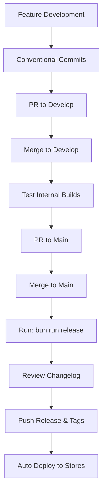

# 🔧 Release Tools Comparison: Standard-Version vs Release-Please

This document compares the two main release automation tools and explains why we chose release-please for our Expo React Native app.

## 📊 Quick Comparison

| Feature | Standard-Version | Release-Please |
|---------|------------------|----------------|
| **Setup Complexity** | ⭐⭐ Simple | ⭐⭐⭐⭐ Complex |
| **Control Level** | ⭐⭐⭐⭐⭐ Full Control | ⭐⭐⭐ Automated |
| **CI/CD Integration** | ⭐⭐⭐ Good | ⭐⭐⭐⭐⭐ Excellent |
| **Team Size** | ⭐⭐⭐⭐⭐ Small-Medium | ⭐⭐⭐⭐ Medium-Large |
| **Learning Curve** | ⭐⭐ Easy | ⭐⭐⭐⭐ Moderate |
| **Flexibility** | ⭐⭐⭐⭐⭐ Very Flexible | ⭐⭐⭐ Structured |

## 🏆 Release-Please (Our Choice)

### ✅ Why We Chose It

1. **Perfect for Mobile Apps** - Professional release management with team review
2. **Industry Standard** - Used by Google, Microsoft, and major open source projects
3. **Team Collaboration** - Release PRs allow team review before deployment
4. **Professional Workflow** - Automated changelog generation and version management
5. **Better for Expo** - Designed for modern CI/CD workflows
6. **Scalable** - Grows with your team and project complexity

### 🔧 Our Enhanced Setup

```bash
# Standard release (auto-detects version bump)
bun run release

# Specific version bumps
bun run release:patch    # 1.0.0 → 1.0.1
bun run release:minor    # 1.0.0 → 1.1.0  
bun run release:major    # 1.0.0 → 2.0.0

# Pre-releases
bun run release:alpha    # 1.0.0 → 1.1.0-alpha.0
bun run release:beta     # 1.0.0 → 1.1.0-beta.0

# Preview changes
bun run release:dry      # See what would happen
```

### 🎯 Perfect For

- **Mobile app development** - Need to coordinate with app store reviews
- **Small to medium teams** - 1-10 developers
- **Projects requiring release control** - Want to decide when to release
- **Teams new to automation** - Easier to understand and debug

## 🤖 Release-Please (Alternative)

### ✅ When to Consider It

1. **Large teams** - Many contributors need structured workflow
2. **High automation needs** - Want completely hands-off releases
3. **GitHub-centric workflow** - Heavy use of GitHub features
4. **Microservices** - Managing multiple packages/services
5. **Established CI/CD culture** - Team comfortable with complex automation

### 🔧 How It Would Work

- Automatically creates release PRs based on commits
- Team reviews and merges release PRs
- Automatically creates GitHub releases
- Triggers production builds automatically

### 🎯 Perfect For

- **Large open source projects** - Google, Microsoft use this
- **Microservice architectures** - Multiple packages to coordinate
- **Teams with strict processes** - Want enforced conventional commits
- **High-frequency releases** - Daily/weekly release cycles

## 🚀 Our Workflow with Standard-Version

### Development Flow


### Release Commands
```bash
# 1. Check what's changed since last release
git log --oneline $(git describe --tags --abbrev=0)..HEAD

# 2. Preview the release
bun run release:dry

# 3. Create the release
bun run release

# 4. Automatic deployment triggered by git tag
```

## 🔄 Migration Path

If you ever want to switch to release-please later:

1. **Keep using standard-version** until you outgrow it
2. **Signs you might need release-please:**
   - Team grows beyond 10 developers
   - You want completely automated releases
   - You need to manage multiple packages
   - Manual releases become a bottleneck

3. **Migration would involve:**
   - Setting up release-please configuration
   - Training team on new workflow
   - Updating CI/CD pipelines
   - Establishing new review processes

## 📚 Best Practices for Our Setup

### Commit Messages
```bash
# Good examples
feat: add user profile customization
fix: resolve crash on app startup
perf: optimize image loading performance
feat!: redesign navigation system

# Bad examples
update code
fix bug
changes
wip
```

### Release Timing
- **Patch releases**: Can be done anytime for critical fixes
- **Minor releases**: Coordinate with team, usually weekly/bi-weekly
- **Major releases**: Plan ahead, coordinate with marketing/business

### Quality Gates
Before any release:
- [ ] All tests passing
- [ ] Latest develop builds tested
- [ ] Breaking changes documented
- [ ] Team notified of upcoming release

## 🎯 Conclusion

**Standard-version is the right choice for us because:**

1. ✅ **It's already working** - No need to fix what isn't broken
2. ✅ **Perfect for mobile apps** - Gives us control over release timing
3. ✅ **Simple for the team** - Easy to understand and use
4. ✅ **Flexible** - Can handle any release scenario
5. ✅ **Reliable** - Fewer moving parts means fewer things can break

We can always migrate to release-please later if our needs change, but for now, standard-version gives us the perfect balance of automation and control.

## 🔗 Related Documentation

- [Release Workflow Guide](./RELEASE-WORKFLOW.md) - How to use our standard-version setup
- [Git Workflow Guide](./GIT-WORKFLOW.md) - Our branching and commit strategies
- [CI/CD Setup](./CI-CD-SETUP.md) - How releases trigger deployments
