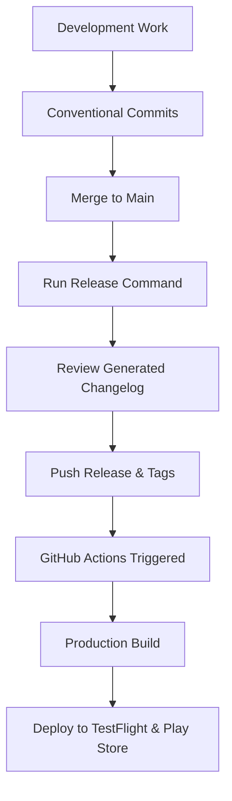

# 🏷️ Release Workflow Guide

This guide covers the release management process for Discover Sports HK using standard-version.

## 📋 Overview

Our release system uses [standard-version](https://github.com/conventional-changelog/standard-version) to:
- Generate changelogs based on conventional commits
- Bump version numbers automatically
- Create git tags for releases
- Trigger production builds and deployments

## 🔄 Release Process Flow



## 📝 Conventional Commits

Our release system relies on [Conventional Commits](https://www.conventionalcommits.org/) to determine version bumps and generate changelogs.

### Commit Message Format

```
<type>[optional scope]: <description>

[optional body]

[optional footer(s)]
```

### Commit Types and Version Impact

| Type | Version Bump | Changelog Section | Example |
|------|--------------|-------------------|---------|
| `feat` | Minor | 🚀 Features | `feat: add dark mode support` |
| `fix` | Patch | 🐛 Bug Fixes | `fix: resolve crash on startup` |
| `perf` | Patch | ⚡ Performance Improvements | `perf: optimize image loading` |
| `BREAKING CHANGE` | Major | Breaking Changes | `feat!: redesign navigation API` |
| `docs` | None | 📚 Documentation | `docs: update API documentation` |
| `refactor` | Patch | ♻️ Code Refactoring | `refactor: simplify auth logic` |
| `test` | None | Hidden | `test: add unit tests for auth` |
| `chore` | None | Hidden | `chore: update dependencies` |
| `ci` | None | Hidden | `ci: update build workflow` |
| `build` | None | Hidden | `build: update webpack config` |

### Examples

#### Feature Addition (Minor Version Bump)
```bash
git commit -m "feat: add user profile customization

- Users can now customize their profile picture
- Added bio and social media links
- Improved profile editing UX"
```

#### Bug Fix (Patch Version Bump)
```bash
git commit -m "fix: resolve memory leak in image cache

The image cache was not properly releasing memory when images
were no longer needed, causing performance issues on older devices.

Fixes #123"
```

#### Breaking Change (Major Version Bump)
```bash
git commit -m "feat!: redesign authentication system

BREAKING CHANGE: The authentication API has been completely
redesigned. Users will need to re-authenticate after this update.

- New OAuth2 implementation
- Improved security with JWT tokens
- Better error handling"
```

## 🚀 Release Commands

### Standard Release (Automatic Version Bump)
```bash
# Analyzes commits and bumps version automatically
bun run release
```

### Specific Version Bumps
```bash
# Force a patch release (1.0.0 → 1.0.1)
bun run release:patch

# Force a minor release (1.0.0 → 1.1.0)
bun run release:minor

# Force a major release (1.0.0 → 2.0.0)
bun run release:major
```

### Pre-release Versions
```bash
# Create alpha pre-release (1.0.0 → 1.1.0-alpha.0)
bun run release:alpha

# Create beta pre-release (1.0.0 → 1.1.0-beta.0)
bun run release:beta
```

### Dry Run (Preview Changes)
```bash
# See what would happen without making changes
bun run release:dry
```

## 📱 Complete Release Process

### 1. Pre-Release Checklist

Before creating a release:

- [ ] **All features tested** - Ensure develop branch builds work correctly
- [ ] **Code review completed** - All PRs have been reviewed and merged
- [ ] **Tests passing** - All automated tests are green
- [ ] **Documentation updated** - README, API docs, etc. are current
- [ ] **Breaking changes documented** - Any breaking changes are clearly noted
- [ ] **App store metadata ready** - Screenshots, descriptions updated if needed

### 2. Create Release

```bash
# 1. Ensure you're on main branch with latest changes
git checkout main
git pull origin main

# 2. Check what commits will be included
git log --oneline $(git describe --tags --abbrev=0)..HEAD

# 3. Preview the release (optional)
bun run release:dry

# 4. Create the release
bun run release

# This will:
# - Analyze commits since last release
# - Bump version in package.json
# - Generate/update CHANGELOG.md
# - Create a git commit with the changes
# - Create a git tag
# - Push everything to GitHub
```

### 3. Post-Release Actions

After running the release command:

1. **Verify the release** - Check GitHub for the new tag and release
2. **Monitor CI/CD** - Watch GitHub Actions for build progress
3. **Check app stores** - Verify TestFlight and Play Store submissions
4. **Update team** - Notify team members of the new release
5. **Monitor for issues** - Watch for any post-release problems

## 🛠 Advanced Release Scenarios

### Emergency Hotfix Release

For critical production issues:

```bash
# 1. Create hotfix branch from main
git checkout main
git pull origin main
git checkout -b hotfix/critical-fix

# 2. Make the fix with proper commit message
git commit -m "fix: resolve critical security vulnerability

This fixes a critical security issue that could allow
unauthorized access to user data.

Fixes #456"

# 3. Push and create PR to main
git push origin hotfix/critical-fix
# Create PR via GitHub UI or gh CLI

# 4. After PR is merged, create hotfix release
git checkout main
git pull origin main
bun run release:patch
```

### Custom Release Messages

You can customize the release commit message:

```bash
# Create release with custom message
COMMIT_MSG="chore(release): v1.2.3 - Holiday Update" bun run release
```

### Skipping Certain Steps

If you need to skip parts of the release process:

```bash
# Skip changelog generation
bun run release --skip.changelog

# Skip git commit
bun run release --skip.commit

# Skip git tag
bun run release --skip.tag
```

## 📊 Version Management

### Semantic Versioning Strategy

We follow [Semantic Versioning](https://semver.org/) (SemVer):

- **MAJOR** (1.0.0 → 2.0.0): Breaking changes, major redesigns
- **MINOR** (1.0.0 → 1.1.0): New features, backwards compatible
- **PATCH** (1.0.0 → 1.0.1): Bug fixes, backwards compatible

### App Store Version Mapping

| Platform | Version Source | Build Number Source |
|----------|----------------|-------------------|
| iOS | `package.json` version | EAS build number |
| Android | `package.json` version | EAS build number |
| Expo | `package.json` version | EAS build number |

### Pre-release Naming

- **Alpha**: `1.0.0-alpha.0` - Internal testing
- **Beta**: `1.0.0-beta.0` - External beta testing
- **RC**: `1.0.0-rc.0` - Release candidate

## 🔧 Configuration

### Standard-Version Configuration

The `.versionrc.json` file controls:
- Which commit types appear in changelog
- Changelog section names and emojis
- URL formats for commits and comparisons
- Files to bump versions in

### Customizing Changelog

Edit `.versionrc.json` to modify changelog sections:

```json
{
  "types": [
    {"type": "feat", "section": "🚀 Features"},
    {"type": "fix", "section": "🐛 Bug Fixes"},
    {"type": "perf", "section": "⚡ Performance Improvements"}
  ]
}
```

## 🚨 Troubleshooting

### Release Command Fails

**Common issues:**
- Uncommitted changes in working directory
- No conventional commits since last release
- Network issues pushing to GitHub

**Solutions:**
```bash
# Check for uncommitted changes
git status

# Stash changes if needed
git stash

# Try release again
bun run release
```

### Wrong Version Bump

If standard-version chooses the wrong version bump:

```bash
# Use specific release type
bun run release:patch  # or :minor, :major
```

### Missing Commits in Changelog

Ensure commits follow conventional format:
- Start with type: `feat:`, `fix:`, etc.
- Use proper format: `type: description`
- Include breaking changes: `feat!:` or `BREAKING CHANGE:`

## 📚 Best Practices

1. **Use conventional commits consistently** - This ensures proper version bumps
2. **Review changelog before pushing** - Make sure it accurately reflects changes
3. **Test before releasing** - Always test the latest develop builds
4. **Coordinate with team** - Don't surprise team members with releases
5. **Monitor post-release** - Watch for issues after deployment
6. **Keep releases focused** - Don't mix too many changes in one release
7. **Document breaking changes** - Always explain what users need to do

## 🔗 Related Documentation

- [Git Workflow Guide](./GIT-WORKFLOW.md)
- [Deployment Pipeline](./DEPLOYMENT-PIPELINE.md)
- [App Publishing Guide](./APP-PUBLISHING.md)
- [CI/CD Setup](./CI-CD-SETUP.md)
